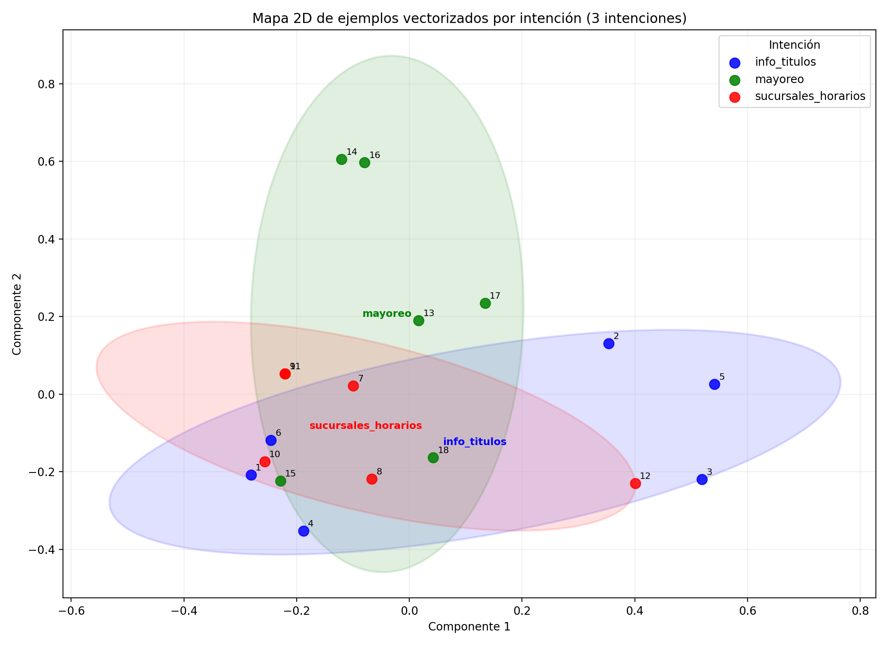

# Tutorial: chatbot básico para una librería con NLP clásico en Python

Este repositorio enseña, paso a paso y en español, cómo construir un chatbot **muy simple** para atención a clientes de una librería usando **NLP clásico** (sin LLMs) con **scikit-learn**.

La idea central del tutorial es separar claramente dos cosas:

1. **Clasificación de intención**: el modelo intenta adivinar qué quiere hacer la persona.
2. **Respuesta del bot**: una vez detectada la intención, el sistema devuelve una respuesta **escrita por humanos**.

Eso significa que el modelo **no inventa respuestas**. Solo estima probabilidades y clasifica mensajes.

---

## 1. ¿Qué vamos a construir?

Un chatbot de consola para una librería con estas 6 intenciones:

- Hacer nuevo pedido
- Cancelar pedido
- Rastrear pedido
- Información sobre títulos
- Información de sucursales y horarios
- Hablar con un especialista para ventas al mayoreo

Más adelante, al final del tutorial, haremos una **mini web app con Streamlit**.

---

## 2. ¿Qué NO hace este bot?

Para mantener el proyecto sencillo y didáctico:

- no usa modelos generativos ni LLMs
- no mantiene memoria de conversación
- no sigue flujos complejos
- no consulta bases de datos reales
- no procesa pagos ni pedidos de verdad

Es un ejercicio educativo para entender la lógica base de un chatbot clásico.

---

## 3. Idea general en palabras simples

Cuando una persona escribe algo como:

> “Quiero saber dónde va mi pedido”

el sistema hace esto:

### Paso A. Clasificar la intención

El modelo mira el texto y calcula cuál intención parece más probable.

Por ejemplo, podría producir algo así:

- rastrear_pedido: 0.81
- cancelar_pedido: 0.09
- nuevo_pedido: 0.05
- otras: menos probables

Después se queda con la más probable: `rastrear_pedido`.

### Paso B. Elegir una respuesta humana

Una vez que el sistema decidió la intención, busca una respuesta predefinida. Por ejemplo:

> “Con gusto te ayudo a rastrear tu pedido. Comparte tu número de pedido para revisarlo.”

Esa respuesta **no salió del modelo**. La escribió una persona.

---

## 4. Estructura del proyecto

```text
chatbot-nlp-libreria/
├── data/
│   └── intents.csv
├── models/
│   └── .gitkeep
├── src/
│   ├── chatbot.py
│   ├── evaluate.py
│   ├── responses.py
│   ├── train.py
│   └── webapp.py
├── .gitignore
├── LICENSE
├── requirements.txt
└── README.md
```

---

## 5. Requisitos previos

Este tutorial está pensado para alguien que ya sabe correr cosas básicas en Python.

Necesitas:

- Python 3.10 o más reciente
- saber abrir una terminal
- saber entrar a una carpeta con `cd`
- saber crear un entorno virtual (o al menos seguir instrucciones)

---

## 6. Instalación

### Opción recomendada: entorno virtual

En la terminal, dentro de esta carpeta, corre:

```bash
python3 -m venv .venv
source .venv/bin/activate
pip install --upgrade pip
pip install -r requirements.txt
```

En Windows sería algo como:

```bash
python -m venv .venv
.venv\Scripts\activate
pip install --upgrade pip
pip install -r requirements.txt
```

---

## 7. Nuestros datos: el archivo `intents.csv`

Este proyecto incluye un archivo con ejemplos de mensajes reales o semi-reales que una persona podría escribir.

Cada fila tiene dos columnas:

- `texto`: lo que escribe la persona usuaria
- `intent`: la intención a la que pertenece

Ejemplo:

```csv
texto,intent
quiero pedir un libro,nuevo_pedido
donde va mi pedido,rastrear_pedido
```

### Muy importante

Aquí dejamos **6 ejemplos por intención** para arrancar.

Eso sirve para aprender, pero es **muy poco** para un bot estable.

La tarea del alumno es expandir el dataset hasta tener **al menos 20 ejemplos por intención**.

En otras palabras:

- ya tienes 6 ejemplos por intención
- debes agregar **14 ejemplos más por cada intención**

Eso te llevará a:

- 20 ejemplos × 6 intenciones = **120 ejemplos** en total

---

## 8. Las 6 intenciones del proyecto

Usaremos estas etiquetas internas:

- `nuevo_pedido`
- `cancelar_pedido`
- `rastrear_pedido`
- `info_titulos`
- `sucursales_horarios`
- `mayoreo`

### Consejo didáctico

Usamos nombres cortos y consistentes porque el modelo no “entiende” el negocio como una persona. Solo aprende patrones a partir de ejemplos etiquetados.

---

## 9. Entrenamiento del modelo

El archivo `src/train.py` hace lo siguiente:

1. lee el dataset
2. separa textos e intenciones
3. convierte el texto en números con `TfidfVectorizer`
4. entrena un clasificador `LogisticRegression`
5. guarda el modelo entrenado en la carpeta `models/`

### ¿Por qué convertir texto en números?

Porque los algoritmos de machine learning no trabajan directamente con palabras humanas. Necesitan una representación numérica.

### ¿Qué hace TF-IDF?

TF-IDF convierte palabras y combinaciones de palabras en una matriz numérica.

No hace “magia semántica”. Solo representa qué términos aparecen y qué tan importantes parecen dentro del conjunto de datos.

Si quieres una imagen mental, piensa que cada frase termina convertida en una lista de números. Esa lista ubica el texto en un espacio matemático donde frases parecidas tienden a quedar relativamente cerca.

Más abajo veremos una forma de dibujar ese espacio en 2D para volver esta idea más tangible.

### ¿Qué hace Logistic Regression?

Aunque el nombre suena matemático, aquí puedes pensar en ella como un clasificador que aprende a separar categorías a partir de ejemplos.

Además, puede devolver **probabilidades estimadas** para cada clase. Eso nos sirve mucho para explicar que la clasificación no es absoluta, sino probabilística.

---

## 10. Entrenar el modelo

Corre esto en la terminal:

```bash
python src/train.py
```

Si todo sale bien, verás un mensaje indicando que el modelo se guardó en:

```text
models/intent_classifier.joblib
```

---

## 11. Probar el chatbot en consola

Una vez entrenado el modelo, ejecuta:

```bash
python src/chatbot.py
```

El programa te dejará escribir mensajes en la terminal.

Por ejemplo:

```text
Tú: quiero cancelar mi compra
```

Y podrías ver una salida como:

```text
Intención detectada: cancelar_pedido
Confianza estimada: 0.73
Bot: Entiendo que deseas cancelar tu pedido. Compárteme tu número de pedido y te indico el siguiente paso.
```

---

## 12. Lo más importante del tutorial: clasificación y respuesta son cosas distintas

Este punto merece repetirse con claridad.

### La clasificación

La hace el modelo.

Entrada:

- un texto de usuario

Salida:

- una intención probable
- un nivel de confianza estimado

### La respuesta

La definimos nosotros en `src/responses.py`.

Es decir:

- el modelo **no redacta** la respuesta
- el modelo **no conversa libremente**
- el modelo solo ayuda a decidir **qué tipo de mensaje recibió**

Después, el sistema usa esa etiqueta para buscar una respuesta escrita por una persona.

---

## 13. ¿Qué pasa si el modelo no está muy seguro?

En `src/chatbot.py` usamos un umbral simple de confianza.

Si la confianza es demasiado baja, el bot responde algo como:

> “No estoy completamente seguro de haber entendido tu solicitud.”

Esto es importante porque enseña una buena práctica: **a veces lo correcto no es fingir certeza**.

---

## 14. Tu tarea como alumna o alumno

Antes de sentir que el bot “ya quedó”, haz esto:

### Expande el dataset

Agrega **14 ejemplos nuevos por intención**.

Procura variar:

- vocabulario
- longitud de la frase
- expresiones formales e informales
- pequeños errores de escritura
- preguntas directas y mensajes incompletos

### Ejemplo de expansión

Si ya tienes:

- “quiero comprar un libro”

puedes agregar variantes como:

- “me gustaría hacer un pedido”
- “quiero encargar una novela”
- “necesito comprar un título”
- “puedo pedir un libro con ustedes”

La clave es enseñar al modelo que una misma intención puede decirse de muchas formas.

---

## 15. Mini lección: cómo leer `train.py`

Para muchas personas no técnicas, una parte difícil de aprender es esta: aunque todavía no entiendas cada detalle matemático, sí conviene saber **qué papel cumple cada pieza**.

La buena noticia es que `train.py` no hace demasiadas cosas. Solo organiza el entrenamiento.

### ¿Qué contiene `src/train.py`?

#### 1. Importaciones

Al inicio importamos herramientas de Python y de scikit-learn.

- `Path`: sirve para construir rutas de archivos de forma clara y portable.
- `csv`: sirve para leer el archivo `intents.csv`.
- `joblib`: sirve para guardar el modelo ya entrenado.
- `TfidfVectorizer`: convierte texto en números.
- `LogisticRegression`: clasifica la intención.
- `Pipeline`: une varios pasos en un solo objeto.

No hace falta memorizar esto desde el primer día. Lo importante es entender para qué entra cada herramienta.

#### 2. Constantes de rutas

Luego aparecen estas rutas:

- `DATA_PATH`: apunta a `data/intents.csv`
- `MODEL_PATH`: apunta al archivo donde se guardará el modelo entrenado

Esto evita escribir rutas “a mano” varias veces y hace el script más ordenado.

#### 3. La función `cargar_datos()`

Esta función abre el CSV y extrae dos listas:

- una lista de textos
- una lista de etiquetas o intenciones

Por ejemplo, si una fila dice:

- texto: `quiero cancelar mi pedido`
- intent: `cancelar_pedido`

entonces el script guarda:

- ese texto en la lista de ejemplos
- esa intención en la lista de etiquetas

En otras palabras: esta función prepara los datos para el entrenamiento.

#### 4. La función `crear_pipeline()`

Aquí se construye la parte más importante del entrenamiento.

La pipeline tiene dos pasos:

1. `TfidfVectorizer`
2. `LogisticRegression`

Eso significa:

- primero el texto se transforma en números
- después esos números se usan para entrenar el clasificador

La ventaja de usar una pipeline es que ambos pasos quedan unidos en un solo objeto. Más tarde, cuando guardamos el modelo, también se guarda esa lógica completa.

#### 5. La función `main()`

Esta es la función principal del script. Hace, en orden, lo siguiente:

1. carga los datos
2. verifica que sí haya ejemplos
3. crea la pipeline
4. entrena el modelo con `fit(...)`
5. guarda el resultado con `joblib.dump(...)`
6. imprime mensajes para confirmar que todo salió bien

Si quieres pensarlo de forma muy humana, `main()` es el “director de orquesta” del archivo.

#### 6. La línea final: `if __name__ == "__main__":`

Esta línea le dice a Python:

> “si este archivo se ejecuta directamente, corre la función `main()`”

Es una convención muy común en Python.

---

### Una forma simple de entender `train.py`

Si todavía te intimida el código, puedes resumirlo así:

- **lee ejemplos etiquetados**
- **convierte palabras en números**
- **entrena un clasificador**
- **guarda el modelo**

Y ya. Ese es su trabajo.

No necesitas dominar toda la teoría de TF-IDF o regresión logística para empezar a usar este archivo con criterio. Primero basta con entender **qué entra, qué transforma y qué sale**.

---

## 16. Mini lección: cómo leer `chatbot.py`

`chatbot.py` hace cuatro cosas simples:

1. carga el modelo entrenado
2. recibe texto desde la terminal
3. predice intención y confianza
4. busca una respuesta humana adecuada

Es una arquitectura muy básica, pero muy buena para aprender.

---

## 17. Una explicación visual de la vectorización

Aquí viene una idea importante: cuando usamos `TfidfVectorizer`, cada texto deja de verse como una frase y pasa a verse como un **vector numérico**.

Eso suena abstracto, así que conviene imaginarlo visualmente.

### Intuición básica

Piensa que cada mensaje del usuario se convierte en un punto dentro de un espacio matemático.

- si dos frases se parecen mucho, sus puntos tienden a quedar cerca
- si dos frases usan vocabulario muy distinto, sus puntos tienden a quedar más lejos

El problema es que ese espacio no suele tener solo 2 o 3 dimensiones. Puede tener decenas, cientos o miles, dependiendo del vocabulario.

Por eso hacemos una pequeña trampa útil: **proyectamos** esos vectores a 2 dimensiones para poder dibujarlos.

### Qué significa esa proyección

La gráfica en 2D **no es el espacio real completo** del modelo.

Es más bien una versión resumida, como un mapa simplificado.

Sirve para responder preguntas como:

- ¿los ejemplos de una misma intención tienden a agruparse?
- ¿hay intenciones muy mezcladas entre sí?
- ¿el dataset parece consistente o caótico?

### Script de visualización

Incluí un script para generar ese mapa:

```bash
python src/visualize_vectors.py
```

Ese script:

1. lee `intents.csv`
2. vectoriza los textos con TF-IDF
3. reduce el espacio a 2 dimensiones con PCA
4. dibuja un scatter plot con colores por intención
5. agrega elipses suaves para mostrar cómo se agrupan los ejemplos de cada intención
6. guarda la imagen en `models/intent_map_2d.png`

### Imagen generada

Para que la visualización sea más clara, esta primera versión muestra solo **3 intenciones** relativamente fáciles de separar visualmente:

- `sucursales_horarios`
- `mayoreo`
- `info_titulos`



### Cómo leer la imagen

Cuando abras la imagen, piensa esto:

- cada punto representa un ejemplo del dataset
- cada color representa una intención
- las elipses muestran, de forma aproximada, la zona donde vive cada grupo
- si dos elipses se acercan o se traslapan, hay más riesgo de confusión entre intenciones
- si varios puntos del mismo color quedan cerca, eso sugiere coherencia

En otras palabras: la gráfica no solo muestra puntos aislados, sino también la **forma general** de cada intención.

Eso ayuda mucho a explicar algo importante a simple vista: algunas categorías están mejor separadas que otras, y cuando dos grupos se parecen demasiado en vocabulario, puede haber **overlap**.

### Importante: no es una prueba absoluta

Esta visualización ayuda mucho a la intuición, pero no reemplaza una evaluación formal.

Es decir:

- una gráfica bonita no garantiza buen desempeño
- una gráfica algo mezclada no significa que todo esté mal

Sirve como herramienta pedagógica para “ver” algo que normalmente sería invisible.

---

## 18. Lección extra: mini web app con Streamlit

Cuando el bot de consola ya funcione, puedes lanzar una interfaz web muy sencilla.

Corre:

```bash
streamlit run src/webapp.py
```

Eso abrirá una app local en tu navegador.

La idea de esta lección no es enseñar desarrollo web completo, sino mostrar cómo envolver el mismo clasificador en una interfaz más amable.

---

## 19. Evaluación básica del modelo

Deja esta parte para el final, cuando ya hayas ampliado el dataset.

Corre:

```bash
python src/evaluate.py
```

Este script hace una evaluación simple con:

- `train_test_split`
- reporte de clasificación
- accuracy

### Ojo

Si evalúas con poquísimos ejemplos, el resultado puede ser engañoso.

Por eso conviene expandir primero el dataset.

---

## 20. Limitaciones de este enfoque

Este chatbot sirve para aprender, pero tiene límites claros:

- depende mucho del dataset
- no entiende contexto conversacional amplio
- no responde bien a frases muy nuevas o ambiguas
- no recupera información real de inventario o pedidos
- puede confundir intenciones parecidas si los ejemplos son pobres

Y eso está bien. Precisamente por eso este proyecto es útil: enseña la base sin vender humo.

---

## 21. Ideas para mejorar después

Cuando este tutorial ya esté dominado, puedes extenderlo con:

- más ejemplos por intención
- intención extra de “otro / no entendí”
- respuestas múltiples por intención
- conexión a una base de datos
- extracción de entidades (por ejemplo, número de pedido o título del libro)
- registro de conversaciones
- panel web más completo

---

## 22. Cómo subirlo a GitHub

Si todavía no lo has subido, puedes hacer algo como esto:

```bash
git init
git add .
git commit -m "Primer commit: tutorial de chatbot NLP para librería"
```

Luego creas un repositorio en GitHub y conectas el remoto:

```bash
git remote add origin TU_URL
git branch -M main
git push -u origin main
```

---

## 23. Resumen final

En este proyecto aprendiste que un chatbot clásico puede construirse como la suma de dos piezas:

1. **Un clasificador de intención** que estima probabilidades.
2. **Un conjunto de respuestas humanas** ligadas a cada intención.

No parece espectacular, pero es una base excelente para entender cómo funcionan muchos sistemas conversacionales sencillos.

Si quieres seguir, el mejor siguiente paso es mejorar el dataset. En problemas como este, los datos importan muchísimo.

